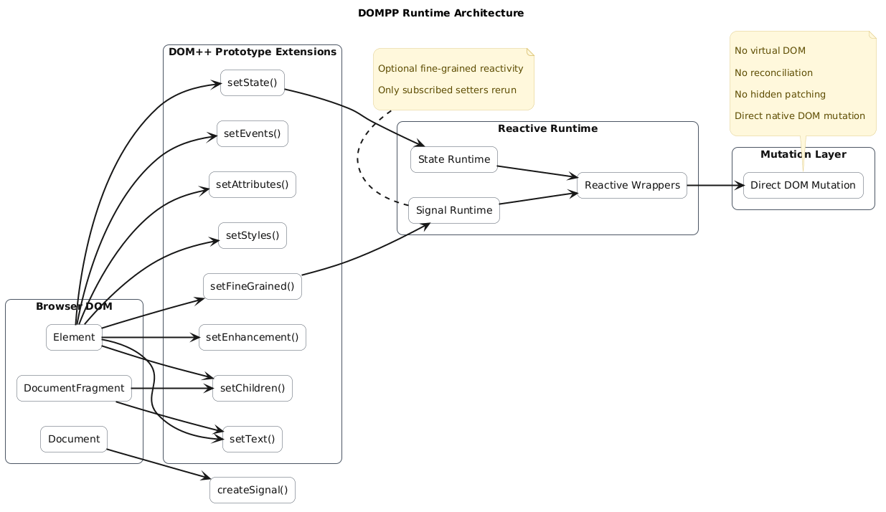
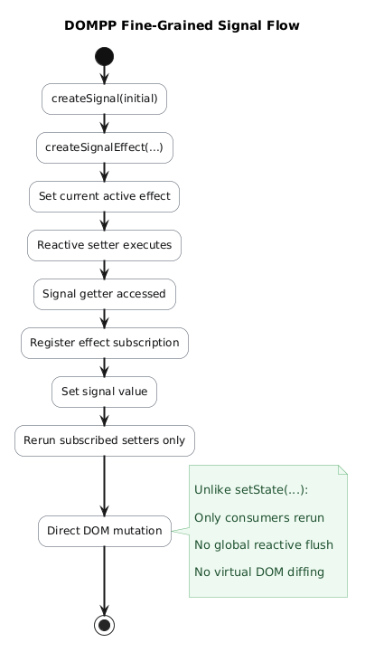
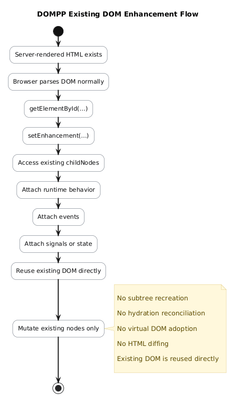

# DOMPP (DOM++)

DOMPP (read as DOM plus plus) is a lightweight native DOM enhancement library focused on deterministic mutation, chainable APIs, optional reactivity, and minimal runtime overhead.

The name "DOM++" is inspired by C++ naming style:

> DOM extended with small, explicit, chainable methods.

DOMPP does not use a virtual DOM.
DOMPP does not wrap elements in custom objects.
DOMPP does not require compilation.

Instead, DOMPP extends native DOM prototypes with ergonomic setters while preserving direct access to the browser platform.

---

# Philosophy

DOMPP is intentionally designed around:

* native DOM first
* explicit mutation
* deterministic updates
* low abstraction overhead
* minimal tooling
* progressive capability

DOMPP should feel like:

```js
const card =
  document
    .createElement("div")
    .setChildren(
      document
        .createElement("h2")
        .setText("Hello DOM++")
    );
```

not like a framework runtime.

---

# Features

## Runtime Architecture

DOMPP extends native DOM APIs with small,
chainable mutation setters and optional
reactive runtimes.

Unlike virtual DOM frameworks, DOMPP performs
direct deterministic DOM mutation.



---

## Chainable DOM Setters

DOMPP adds a small set of chainable mutation helpers:

* `setText(...)`
* `setChildren(...)`
* `setStyles(...)`
* `setAttributes(...)`
* `setEvents(...)`
* `setState(...)`
* `setEnhancement(...)`
* `setFineGrained(...)`

---

## Stateful Reactive Runtime

DOMPP includes an optional element-local reactive runtime using `setState()`.

```js
const counter =
  document
    .createElement("button")
    .setState({
      count: 0
    })
    .setText(({ state }) => {
      return `Count: ${state.count}`;
    })
    .setEvents(({ state, setState }) => ({
      click() {
        setState({
          count: state.count + 1
        });
      }
    }));
```

Reactive setter callbacks rerun automatically after state updates.

---

## Fine-Grained Signals

DOMPP also supports optional fine-grained signals.

```js
const [count, setCount] =
  document.createSignal(0);

const title =
  document
    .createElement("h1")
    .setFineGrained()
    .setText(() => {
      return count();
    });
```

Signals are completely optional.

DOMPP still supports the original stateful runtime model.



---

## Existing DOM Enhancement

DOMPP can enhance existing server-rendered or static HTML without recreating the subtree.

```html
<section id="counter-app">
  <h2>0</h2>
  <button>+</button>
</section>
```

```js
document
  .getElementById("counter-app")
  .setEnhancement(({ childNodes }) => {

    childNodes[1].setEvents({
      click() {
        childNodes[0].setText("1");
      }
    });
  });
```

This allows DOM assimilation without hydration frameworks or virtual DOM diffing.



---

# Core Concepts

## Consistent Mutation APIs

DOMPP setters are intentionally designed to be consistent.

Example:

```js
element.setText("Hello");
```

can later become:

```js
element.setText(({ text }) => {
  return text + "!";
});
```

The same pattern applies to:

* `setStyles()`
* `setAttributes()`
* `setChildren()`
* `setEvents()`

This removes the need to mentally switch between:

* `appendChild()`
* `replaceChildren()`
* `innerHTML`
* `replaceWith()`
* `textContent`
* `setAttribute()`

DOMPP keeps mutation ergonomics predictable.

---

## children vs childNodes

Setter callbacks expose both:

* `children`
* `childNodes`

### `children`

Element-only children.

Whitespace text nodes are excluded.

```js
setChildren(({ children }) => {
  return [
    children[0]
  ];
});
```

Useful for:

* hydration
* enhancement
* reusable element references

---

### `childNodes`

Raw node list.

Includes:

* text nodes
* whitespace
* comments
* elements

```js
setChildren(({ childNodes }) => {
  return [
    childNodes[0],
    childNodes[1]
  ];
});
```

Useful when preserving exact DOM structure.

---

# Fine-Grained vs Stateful Runtime

DOMPP supports two reactive models.

## Stateful Runtime

Uses:

```js
setState(...)
```

Reactive setters rerun after state updates.

Simple and ergonomic.

---

## Fine-Grained Signals

Uses:

```js
document.createSignal(...)
```

Only setters directly consuming signals rerun.

Useful for:

* granular updates
* explicit subscriptions
* minimal reruns

Signals are opt-in via:

```js
.setFineGrained()
```

---

# ESM Architecture

As of `1.1.1`, DOMPP is internally modularized using ESM.

This improves:

* maintainability
* scalability
* unit testing
* runtime separation

Structure:

```txt
src/
  1.1.1/

    context/
    core/
    install/
    runtime/
    setters/
    utils/
```

---

# Project Structure

```txt
/
├── docs/
├── examples/
├── src/
├── tests/
├── index.html
├── server.js
├── README.md
├── package.json
└── ...
```

---

# Quick Start

## Install

Clone the repository:

```bash
git clone <repository-url>
```

---

## Run Local Dev Server

```bash
node server.js
```

Open:

```txt
http://localhost:5173
```

The examples page includes:

* basic setters
* mutation consistency
* children vs childNodes
* reactive state
* signals
* enhancement
* existing DOM assimilation

---

# Basic Example

```html
<div id="app"></div>

<script type="module">

import "./src/index.js";

const card =
  document
    .createElement("div")

    .setStyles({
      padding: "20px",
      background: "black",
      color: "white"
    })

    .setChildren(

      document
        .createElement("h1")
        .setText("Hello DOM++"),

      document
        .createElement("button")
        .setText("Click Me")
        .setEvents({
          click() {
            alert("DOM++");
          }
        })
    );

app.append(card);

</script>
```

---

# JSX Integration

DOMPP works with JSX via a custom factory function. Configure your bundler (Vite, esbuild, Parcel, etc.) or use Babel Standalone with the `/** @jsx d */` pragma.

```js
/** @jsx d */
function d(tag, props, ...children) {
  // SVG elements
  const svgTags = new Set([
    "svg", "circle", "path", "rect", "line", "polyline", "polygon", "ellipse",
    "g", "defs", "use", "symbol", "text", "tspan", "textPath",
    "image", "foreignObject", "mask", "clipPath", "pattern",
    "linearGradient", "radialGradient", "stop",
    "filter", "feGaussianBlur", "feColorMatrix",
    "animate", "animateTransform", "animateMotion",
    "marker", "view", "switch", "a", "script", "style", "title", "desc", "metadata"
  ]);

  let node;
  if (tag === "fragment" || tag === "Fragment") {
    node = document.createDocumentFragment();
  } else if (svgTags.has(tag)) {
    node = document.createElementNS("http://www.w3.org/2000/svg", tag);
  } else {
    node = document.createElement(tag);
  }

  if (props) {
    const { style, className, class: classAttr, on, ...attrs } = props;
    if (className || classAttr) node.setAttributes({ class: className || classAttr });
    if (style) node.setStyles(style);
    if (on) node.setEvents(on);
    if (Object.keys(attrs).length) node.setAttributes(attrs);
  }
  if (children.length) node.setChildren(...children.flat());
  return node;
}
```

Usage:

```jsx
/** @jsx d */
import "./src/index.js";

const app = document.getElementById("app");

// Fragment support
const items = (
  <fragment>
    <div className="item">A</div>
    <div className="item">B</div>
    <div className="item">C</div>
  </fragment>
);

// SVG support
const icon = (
  <svg viewBox="0 0 24 24" width="24" height="24">
    <circle cx="12" cy="12" r="10" fill="currentColor" />
  </svg>
);

app.setChildren(
  <section className="card">
    {items}
    {icon}
  </section>
);
```

See `examples/21-jsx-integration/` for a live demo with:
- Basic usage
- Stateful panels with `setState` + reactive `setChildren`
- Cross-element updates
- Fine-grained signals (`document.createSignal` + `.setFineGrained()`)

---

# Testing

DOMPP uses:

* native Node.js test runner
* native ESM
* zero test dependencies

Run tests:

```bash
npm test
```

Or directly:

```bash
node --test
```

Tests focus primarily on:

* runtime behavior
* signals
* utilities
* state scheduling
* deterministic mutation logic

Browser integration testing is demonstrated through the examples.

---

# Design Principles

* Explicit over magical behavior
* Native platform first
* No virtual DOM
* No hidden reconciliation
* No compiler required
* Minimal runtime surface area
* Predictable mutation flow
* Optional reactivity

---

# Status

DOMPP is experimental and under active iteration.

Breaking changes may occur while APIs and runtime architecture continue evolving.

The project exists primarily to explore:

* DOM mutation ergonomics
* reactive runtime design
* enhancement-based hydration
* fine-grained subscriptions
* native-first UI architecture

---

# Contributing

Contributions are welcome.

Please read:

* CONTRIBUTING.md

before submitting large architectural changes.

DOMPP prioritizes:

* clarity
* minimalism
* deterministic behavior
* native DOM mental models

---

# Live Documentation

Live documentation: https://dompp.digital/

---

# License

MIT License

Copyright (c) Dimas Pandu Pratama
