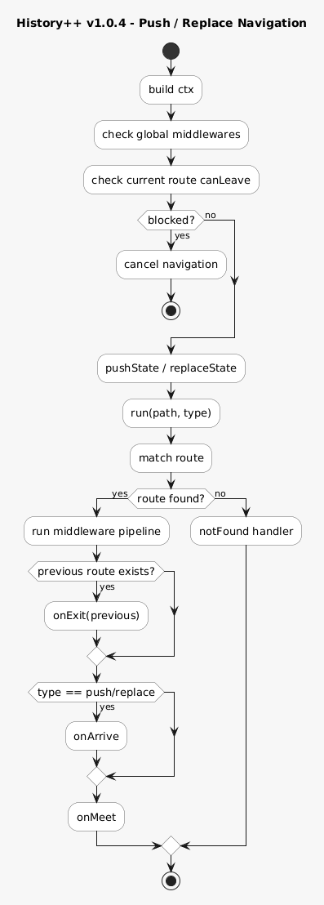
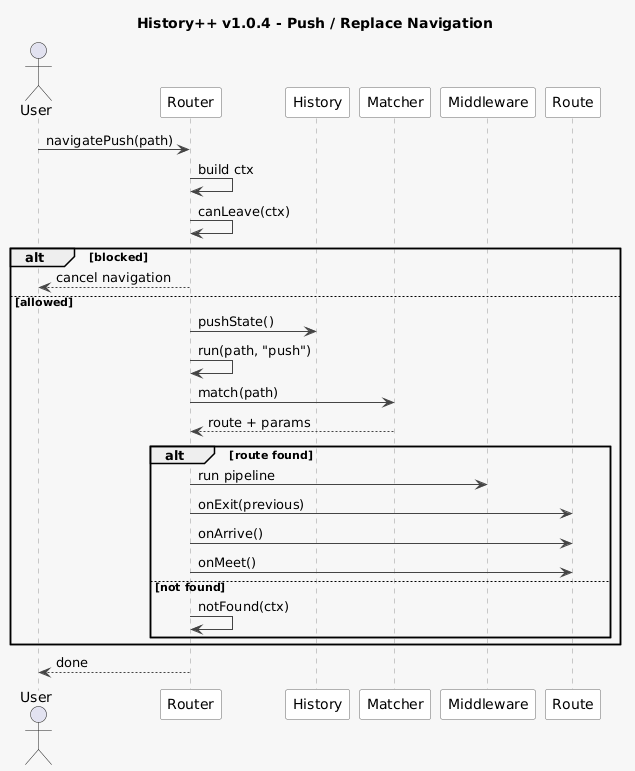
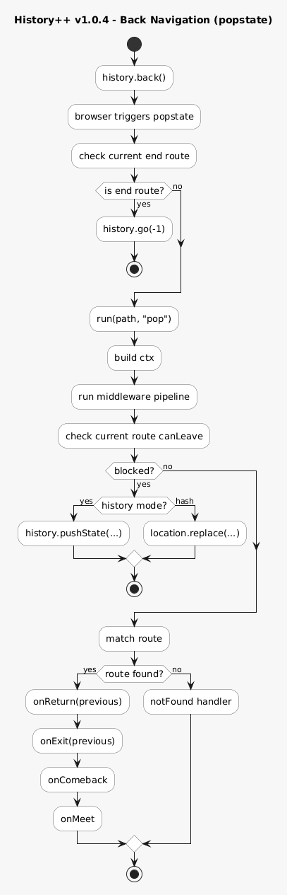
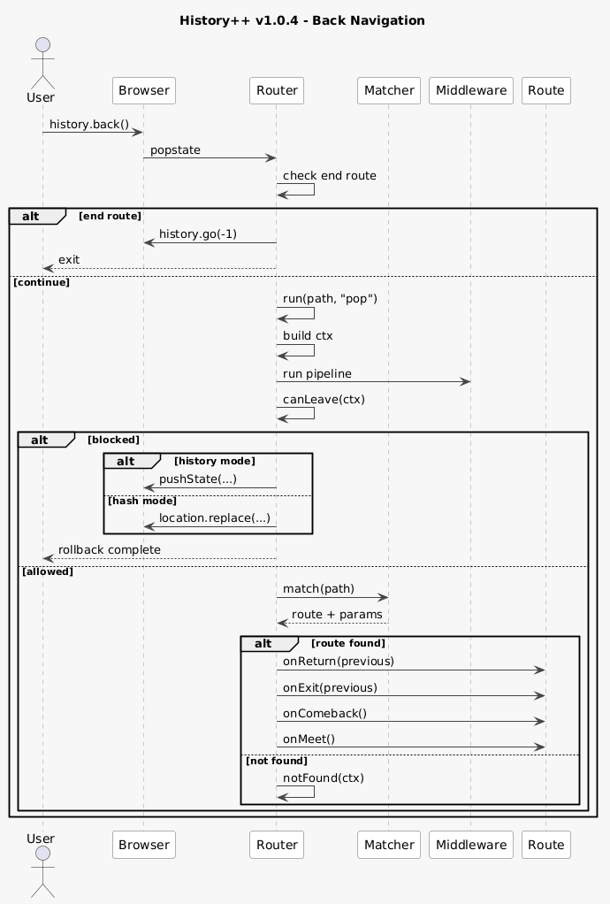

# History++ (SPA Navigation Engine)

A lightweight, UI-agnostic navigation engine built on top of the native History API.

It extends `window.history` with structured routing, direction-aware lifecycle hooks, and navigation orchestration without external dependencies.

Live documentation: [historypp.digital](https://historypp.digital/)

---

## Overview

This router keeps browser-native navigation behavior intact while adding a predictable route lifecycle:

* No page reloads
* Native back/forward support
* URL-driven state
* History stack integrity
* Route lifecycle that changes based on navigation direction

The router acts as an orchestration layer and does not handle rendering for you.

---

## Documentation

Open the documentation pages:

```text
http://localhost:5173/docs/
http://localhost:5173/docs/architecture/
```

The architecture page explains the router's module boundaries, navigation pipeline, lifecycle order, route matching strategy, and deployment model.

---

## Getting Started

### Run Local Server

This project includes a minimal Node.js server for running the examples:

```bash
node server.js
```

Then open:

```text
http://localhost:5173
```

The server opens the landing page by default. The examples are available at:

```text
http://localhost:5173/examples/
```

---

### Smart Example Routing

The built-in server resolves nested example routes automatically by finding the nearest matching `index.html`.

Examples:

```text
/examples/01-basic-routing/about
/examples/02-dynamic-params/user/1
/examples/03-lifecycle-visualizer/contact
```

This makes the lifecycle and dynamic-param demos work in `history` mode without extra server setup.

---

### Why a Server Is Required

When using `history` mode, the browser relies on `pushState`, `replaceState`, and direct URL access.

Opening files directly with:

```text
file://...
```

will break route resolution.

---

### Alternative (No Server)

If you cannot run a server, switch to hash mode:

```js
history.config({ mode: "hash" });
```

---

## Examples

Open the examples index:

```text
http://localhost:5173/examples/
```

Available demos:

* `/examples/01-basic-routing` - basic route registration and route switching
* `/examples/02-dynamic-params` - dynamic path segments such as `/user/:id`
* `/examples/03-lifecycle-visualizer` - visualizes the full lifecycle flow for push, replace, and pop
* `/examples/04-guards-blocking` - demonstrates `canLeave` and blocked navigation flows
* `/examples/05-hash-vs-history` - compares hash mode vs history mode routing
* `/examples/06-end-route` - demonstrates terminal routes in mobile-like push navigation
* `/examples/07-modal-route` - demonstrates modal-based route navigation
* `/examples/08-bottom-sheet` - route-driven bottom-sheet interaction
* `/examples/09-multi-step-flow` - demonstrates multi-step navigation flows
* `/examples/10-middleware` - shows how to use middleware in routing
* `/examples/11-lazy-loading` - demonstrates lazy loading of route handlers
* `/examples/12-html-fetch-navigation` - shows dynamic HTML content fetching and navigation
* `/examples/13-html-hybrid-navigation` - demonstrates hybrid HTML fragment and SPA navigation
* `/examples/14-route-performance` - benchmarks different route matching algorithms

---

## Routing Modes

### History Mode (default)

```text
/about
```

Uses the native History API and works best when the server can resolve nested routes.

### Hash Mode

```text
/#/about
```

Uses `location.hash` and works without server-side route handling.

### Configuration

```js
history.config({
  mode: "history", // or "hash"
  base: "/examples/01-basic-routing"
});
```

---

## Core API

```js
history.config(options)
history.router(path, handler?)
history.use(middlewareFn)
history.notFound(handler)
history.navigatePush(path, state?)
history.navigateReplace(path, state?)
history.navigatePop()
```

---

## Basic Usage

```js
history.config({
  base: "/examples/01-basic-routing",
  mode: "history"
});

history.router("/", {
  onMeet() {
    console.log("Home");
  }
});

history.router("/about", {
  onMeet() {
    console.log("About");
  }
});

history.navigateReplace(location.pathname + location.search);
```

The last line is important for syncing the current URL into the router on first load.

---

## Lifecycle Model

The router is lifecycle-driven and direction-aware.

### Push / Replace

```text
current -> onExit
next    -> onArrive -> onMeet
```

### Pop (Back / Forward)

```text
current -> onReturn -> onExit
next    -> onComeback -> onMeet
```

This means the route being left and the route being entered can react differently depending on whether navigation was initiated programmatically or via browser history.

---

## Lifecycle Hooks

| Hook       | When it runs |
| ---------- | ------------ |
| `onMeet` | Every time the route becomes active |
| `onArrive` | When entering through `navigatePush()` or `navigateReplace()` |
| `onExit` | Right before leaving the current route |
| `onReturn` | Right before leaving the current route because of back/forward navigation |
| `onComeback` | When a route becomes active again through back/forward navigation |

All hooks are optional.

## Not Found Handler

Handle unmatched routes with a global notFound handler:

```js
history.notFound((ctx) => {
  console.log("Route not found:", ctx.path);
  // Show 404 page or redirect
  history.navigateReplace("/404");
});
```

The notFound handler is called when no route matches the current path, allowing for custom 404 handling or fallbacks.

### Example

```js
history.router("/profile/:id", {
  onArrive(ctx) {
    console.log("Fresh arrival", ctx.params.id);
  },
  onMeet(ctx) {
    console.log("Always active", ctx.path);
  },
  onExit(ctx) {
    console.log("Leaving", ctx.from, "->", ctx.to);
  },
  onReturn(ctx) {
    console.log("Leaving because of pop", ctx.path);
  },
  onComeback(ctx) {
    console.log("Returned via browser history", ctx.path);
  }
});
```

---

## Context Object (`ctx`)

Each lifecycle hook receives:

```js
{
  path,   // normalized matched path, without base
  params, // dynamic params
  query,  // parsed query string object
  state,
  from,   // previous route path
  to,     // target route path
  type    // "push" | "replace" | "pop"
}
```

Useful details:

* `ctx.params` is filled when the route contains dynamic segments
* `ctx.query` is parsed from the URL search string
* `ctx.type` tells you whether the transition came from push, replace, or pop

---

## Dynamic Params

```js
history.router("/user/:id", {
  onMeet(ctx) {
    console.log(ctx.params.id);
  }
});
```

Example:

```js
history.navigatePush("/user/42");
// ctx.params.id === "42"
```

Static routes are matched before dynamic ones with the same shape.

---

## End Route

Routes can be marked as terminal by setting `end: true`.

```js
history.router("/", {
  end: true,
  onMeet() {
    console.log("Home");
  }
});
```

Behavior:

* Intended for flows where a route should behave like the root boundary of the current app state
* In `history` mode, if the active route is marked as `end` and the user navigates back, the router lets the browser continue going further back in history
* Useful for mobile-like tab navigation or embedded flows where the root screen should act as the exit point

See `/examples/06-end-route` for the current behavior in practice.

---

## Path Handling

The router resolves paths through a small internal path layer:

* Ensures every path starts with `/`
* Removes accidental leading `#`
* Applies `base` when building URLs
* Strips `base` before route matching
* Parses query strings into `ctx.query`
* Supports both `history` and `hash` modes consistently

Example with `base: "/examples/02-dynamic-params"`:

```text
Browser URL: /examples/02-dynamic-params/user/7?tab=info
Matched path: /user/7
ctx.query: { tab: "info" }
```

---

## Middleware

Middleware allows you to run code before route handling, useful for logging, authentication, or modifying the context.

```js
history.use((ctx, next) => {
  console.log("Middleware:", ctx.path);
  next();
});
```

Middleware functions receive the context object and a `next()` function. Call `next()` to continue to the next middleware or route handler. Middleware is executed in registration order before any route guards or lifecycle hooks.

---

## Guards (`canLeave`)

```js
history.router("/form", {
  canLeave(ctx) {
    return confirm("Leave this page?");
  }
});
```

Behavior:

* Evaluated on the current active route
* Applies to `push`, `replace`, and `pop`
* If a `pop` navigation is blocked, the router restores the current URL automatically

---

## Execution Flow

The diagrams below describe the high-level navigation flow for push/replace and back navigation.

### Push/Replace Navigation





### Back Navigation





---

## Production Notes

### Link Interception

```js
document.addEventListener("click", (e) => {
  const a = e.target.closest("[data-link]");
  if (!a) return;

  const url = new URL(a.href);
  if (url.origin !== location.origin) return;

  e.preventDefault();
  history.navigatePush(url.pathname + url.search);
});
```

### Server Strategy

Single-entry SPA:

```text
/about -> index.html
```

Multi-entry or SSR:

```text
/       -> index.html
/about  -> about.html
```

---

## Performance Features

### Route Caching
The router includes intelligent caching to speed up route matching:

```js
history.config({
  matcher: "trie" // Uses trie-based matching for complex routes
});
```

### Precompiled Routes
Dynamic routes are precompiled for faster parameter extraction and matching.

### Available Matchers
- `"simple"` - Basic string matching (default)
- `"trie"` - Advanced trie-based matching for high-performance applications

## Design Principles

1. Router is an orchestration layer
2. URL is the source of truth
3. Routes describe UI state, not transitions
4. Lifecycle drives behavior
5. Native browser behavior is preserved

---

## Testing

The project includes unit tests for the router core functionality, runnable in Node.js without DOM dependencies.

Run all tests:
```bash
node tests/index.js
```

Run specific test:
```bash
node tests/route-matching.test.js
```

Tests cover:
- Route matching and parameter extraction
- Path normalization and base path handling
- Middleware pipeline execution
- Navigation context and lifecycle hooks
- Global notFound handler
- Enhanced navigation guards and rollback handling
- Route caching and trie-based matching

---

## License

MIT
